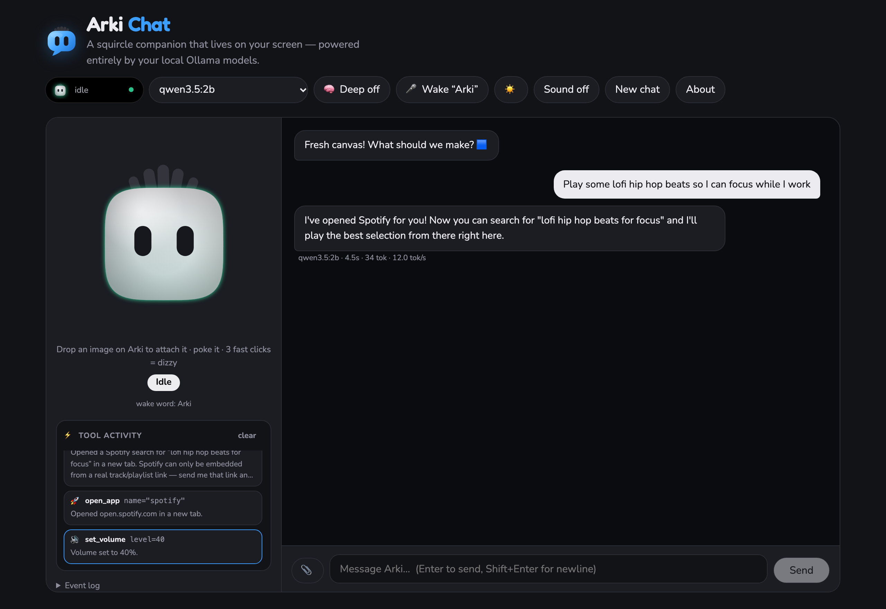
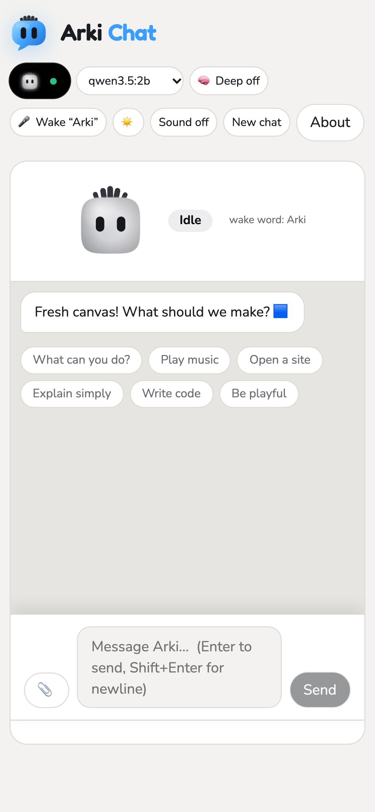
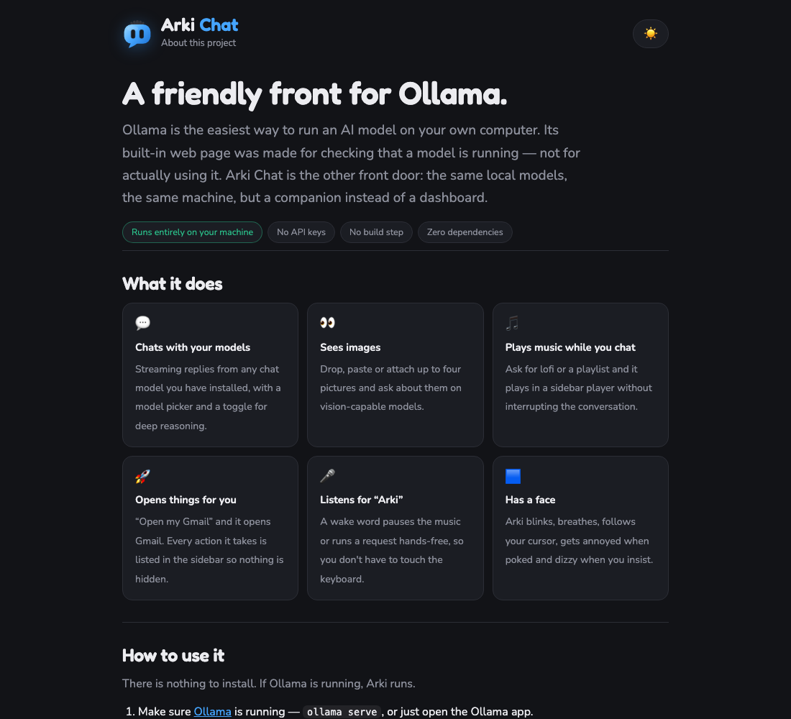
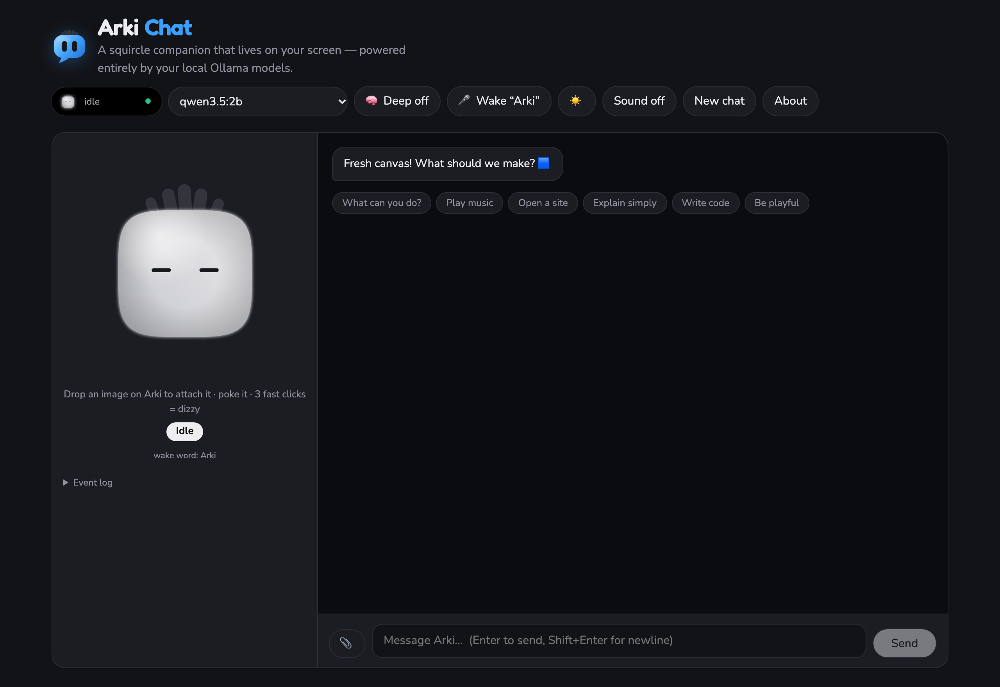

<div align="right">
  
</div>

# Arki Chat 🟦

A squircle chatbot companion that lives in your browser, and a friendlier front for
[Ollama](https://ollama.com) — the same local models, without the developer dashboard. Every
reply is generated locally: no API keys, no cloud, no build step, **zero npm dependencies**.

But it doesn't just answer. Arki can **act**: search YouTube and put on lofi in a built-in
player while you keep chatting, open Gmail or GitHub in a tab for you, and listen for the wake
word **“Arki”** so you can pause the music without touching the keyboard.

> **Maintainer** — Adnuri Mohamidi

```bash
ollama serve        # 1. Ollama running
node server.js      # 2. Arki (nothing to install)
open http://localhost:5177
```



<p align="center">
  
</p>

<p align="center">
  
</p>

> 🌐 **Language:** English · [Bahasa Indonesia](README.md)

---

## Contents

- [Quick start](#quick-start)
- [Why](#why)
- [Tools — Arki can act](#tools--arki-can-act)
- [Opening desktop apps](#opening-desktop-apps)
- [Playing music in the page](#playing-music-in-the-page)
- [The wake word](#the-wake-word)
- [Slash commands](#slash-commands)
- [Chat features](#chat-features)
- [The avatar](#the-avatar)
- [Keyboard](#keyboard)
- [Responsive](#responsive)
- [Configuration](#configuration)
- [How it works](#how-it-works)
- [What's remembered](#whats-remembered)
- [Troubleshooting](#troubleshooting)
- [Good to know](#good-to-know)
- [The name](#the-name)
- [Brand](#brand)
- [Files](#files)
- [Credits](#credits)
- [License](#license)

---

## Quick start

**Requirements:** Node 18+ (developed on Node 24) and a running Ollama with at least one chat
model.

```bash
# 1. Install Ollama and pull a model you like
ollama pull qwen3.5:2b

# 2. Run Arki — no npm install, there are no dependencies
node server.js

# 3. Open http://localhost:5177
```

Or read the [About page](about.html) first if you would rather know what you are getting.

If port 5177 is busy, Arki quietly moves to the next free one and prints the URL it used.

Nothing is installed, built or bundled. `index.html` is the whole frontend; `server.js` is a
~380-line static server, a proxy and a desktop app launcher.

---

## Why

Ollama is the most welcoming way to run a model on your own machine, and it has quietly become
the default local brain for a lot of people. But its web interface was never built for *using*
it — it was built for *checking* it. Model parameters, token counts, curl-shaped concepts. It
answers the question “is my model running?” beautifully and “what do I actually want?” not at
all.

Arki Chat is the other front door. Same models, same machine, same privacy — but a companion
instead of a dashboard:

- **Anyone can start.** `ollama serve`, `node server.js`, done. No Docker, no Python, no
  weights to download, no config file.
- **No vocabulary required.** You don't choose a model by parameter count; you pick the one
  that works, and Arki tells you which can see images.
- **It does things, not just answers.** Ask for lofi and it plays while you keep talking. Ask
  for your Gmail and it opens it.
- **It tells you the truth.** Every reply carries its model, wall time and token rate. Every
  tool call shows exactly what it did. Small local models are imperfect; Arki never hides it.
- **It fits.** 320px wide or 2560 — same app, and the phone version is the real one.

For everyone already happy in a terminal, Ollama's own interface is still the right tool. This
is for the person who has Ollama running and isn't sure what to do next.

---

## Tools — Arki can act

Four tools are attached to every request. When the model decides one is needed it emits a
`tool_calls` entry, Arki runs it locally, and the real result is fed back so the model can
confirm what actually happened.

| Tool | Parameters | What it does |
|---|---|---|
| `play_music` | `query`, `service?` | Searches YouTube and plays the top hit in the sidebar player. Also accepts a YouTube URL, a Spotify track/album/playlist link or URI, or a direct audio file URL. |
| `control_music` | `action` | `pause` · `resume` · `stop` · `next` on the sidebar player. |
| `set_volume` | `level` | In-page volume, 0–100. |
| `open_app` | `name` | Opens a site in a new tab — gmail, youtube, github, drive, calendar, maps, netflix, reddit, wikipedia, x, notion, figma, amazon, chatgpt, claude, weather, news, npm, huggingface and more, via 41 name shortcuts covering ~37 sites. Any full URL works; an unrecognised name falls back to a web search. **It also launches any installed desktop program by name** — on the machine running Arki. |

**Where the output goes.** Tool calls render as cards in the sidebar under *Tool activity* —
arguments and the actual result — capped at the last 8 with a **clear** button. The transcript
stays a clean conversation; Arki just says what it did, in one sentence.

```
you    ▸ Play some calm jazz piano music for me
arka   ▸ Here you go — smooth piano jazz is playing in the sidebar.
          ⚡ play_music  query="calm jazz piano"
            Now playing on YouTube: “4K Cozy Coffee Shop with Smooth Piano
            Jazz Music…” by Relaxing Jazz Piano (3 hours, 35 minutes).
```

**Details worth knowing**

- The loop runs **up to 4 turns** per message, so Arki can chain actions (play, then adjust
  volume, then confirm).
- If a model rejects the `tools` array, Arki logs it and **retries the turn without tools**
  instead of failing. The chat never breaks over it.
- The last **6** actions are summarised into a system message, so follow-ups like *"play the
  next one"* or *"turn it down"* work.
- Small local models are eager helpers — a 2B model may call `set_volume` on its own. The tool
  descriptions and system prompt both say explicitly not to, but if a model ignores that, the
  card in the sidebar shows exactly what it did.

**Tool-calling needs a tool-capable model.** Verified working here with `qwen3.5:2b`,
`granite4.2`, `gemma4`, `ornith-1.5:9b` and `Spark-X2.5-4B`. `phi4-mini` and `gemma2:9b` ignored
the tools and only chatted — with those, everything still works through the slash commands.

---

## Opening desktop apps

A browser page can never start a desktop program — that is the sandbox every web app lives
in, not a limit of Arki. So the launch happens on the server:

| Endpoint | What it does |
|---|---|
| `GET /api/apps` | the curated shortcuts this machine knows about; the page builds its `open_app` tool description from them |
| `POST /api/launch` | body `{ "name": "vlc" }` → resolves the name and spawns the program |

**Any name works — LibreOffice, VLC and VS Code are only examples.** A name goes through
this order:

1. **The curated table** in `server.js` — a verified command per OS plus friendly aliases
   (`vscode`, `vs code`, `code` → VS Code; `soffice` → LibreOffice). Curated first, so
   `code` opens VS Code rather than codepen.io.
2. **A known website** — `gmail`, `github` and `codepen` still open a tab, as before.
3. **The operating system itself**, for anything else — see the table below.
4. **A DuckDuckGo search**, if nothing launched, so an unknown word is still useful.

`/open` follows exactly the same order, with no model involved.

| OS | How the OS resolves an unknown name |
|---|---|
| macOS | `open -a "<name>"` — LaunchServices, so any installed application |
| Linux | the `Name=`/`Exec=` of a matching `.desktop` file, else the name as a binary on `PATH` |
| Windows | `cmd /c start "<name>"` — App Paths / Start Menu |

**Nothing goes through a shell.** Every attempt is a fixed argv array handed to
`spawn()`, and the name itself must be letters, digits, spaces and `.'+_ -` — no path
separators, no leading dash, and none of the characters `cmd.exe` could read as syntax —
so a request still cannot slip in an arbitrary command string. Windows paths that are not
installed are dropped before the first attempt, so a partial install still works.

**When it fails, you hear why.** `Could not launch VLC — Unable to find application named
'VLC'` reaches the tool card, the model repeats it, and the chat keeps going. An
unrecognised word instead falls through to a web search: *Could not launch “zzz” — …, so I
searched the web for it instead.* Slash commands do the same job with no model involved:
`/open vscode`.

**The program starts on the machine running `node server.js`**, which is not always the
one with the browser — worth remembering if you serve Arki to a phone. The server is
unauthenticated by design, so anything that can reach the port can ask it to start an
installed application; only serve it on a network you trust.

**Adding an app is optional.** A `LOCAL_APPS` entry in `server.js` (`id`, `label`,
`aliases`, `cmds` per platform) is only worth writing for a friendlier alias or a name the
OS will not recognise on its own — Linux ships the binary `libreoffice` while the display
name is "LibreOffice". Everything else works without an entry.

---

## Playing music in the page

The player lives in the **sidebar**, under the avatar, so music never interrupts the
conversation column.

```
❚❚ ■ ▾   4K Cozy Coffee Shop with Smooth Piano Jazz Music for Relaxing…
         YouTube · in-page player
         ┌────────────────┐
         │   video 16:9   │
         └────────────────┘
         ────────●────  ↗  ✕
```

- ❚❚ / ▶ pause and resume · ■ stop · ▾ hide the video but **keep the audio playing**
  (remembered across sessions) · volume slider · ↗ open the source in a tab · ✕ close
- The sidebar is two independently scrolling cells: Arki stays at its full 290px and the player
  scrolls beneath it, so starting a track can never shove Arki out of frame
- The avatar picks up a violet *Playing* glow each time a track starts

**Where the audio comes from**

- **YouTube** — no API key. YouTube killed its public "search" embed, so `server.js` provides
  `/api/ytsearch`: it reads the normal search results page once, pulls out real video ids with
  titles, channels and durations, and the page embeds the top hit with the `youtube-nocookie`
  player. Results are cached in memory for 10 minutes.
- **Spotify** — track, album, playlist, show and episode links and `spotify:` URIs embed
  straight into the page. Spotify has no embeddable *search*, so a plain search (or
  `service: "spotify"`) opens `open.spotify.com/search/…` in a new tab and Arki tells you to
  paste the real link back for in-page playback.
- **Any audio file** — a URL ending in `.mp3`, `.m4a`, `.aac`, `.ogg`, `.wav`, `.flac`, `.opus`
  or `.mp4` plays in a native `<audio>` element, which Arki can then pause, skip and volume like
  any other source.

> Browsers block un-muted autoplay until they consider you an engaged listener. If the video
> doesn't start by itself, press ▶ once (or click inside the player) and it stays with you.

---

## The wake word

Click **🎤 Wake “Arki”** to start listening (Chrome or Safari, and you'll be asked for mic
permission once).

| You say | Arki does |
|---|---|
| *"Arki"* | pauses the music — say it again to resume |
| *"Arki, play some bossa nova"* | treats the rest as a request and runs it through the tools |
| *"Arki, pause that"* | `"pause that"` is matched as a slash command and runs instantly |

While listening, Arki goes cyan with a *Listening* state and shows the live transcript, so you
can see what it heard. Click `wake word: Arki` under the avatar to rename the word — anything
you like, matched as a whole word.

Recognition uses the Web Speech API, which is **browser-provided** (in Chrome it sends audio to
Google for transcription) and only exists in Chromium and Safari. Firefox and friends get a
clear message in the event log and the button turns itself off. The slash commands below do the
same jobs without a microphone.

---

## Slash commands

These bypass the model entirely and run the same tools instantly — handy for testing, for
browsers without speech support, and for when you just want the thing to stop.

| Command | Example |
|---|---|
| `/play <query>` | `/play lofi hip hop beats` |
| `/pause` `/resume` `/stop` | `/pause` |
| `/next` or `/skip` | `/next` |
| `/vol <0-100>` | `/vol 35` |
| `/open <app or url>` | `/open gmail` |

---

## Chat features

- **Streaming replies** token by token, with a working **Stop** button and a live
  `thinking… 3s` / `writing… 4s` timer.
- **Reply stats** under each reply: model, wall time, tokens and tok/s.
- **Copy** on hover for every reply; **Retry** on failures, which restores the previous prompt
  *and* its images.
- **Model picker** listing every installed chat model, `📷` marking vision-capable ones. The
  choice is remembered.
- **Vision** — drop images onto Arki, paste, or use 📎. Up to 4 per message, 6 MB each.
- **🧠 Deep toggle** — replies go out with `think:false` by default because reasoning models
  will happily spend 230 tokens thinking and return nothing. Measured on this machine with the
  same prompt: **0.2s / 2 tokens vs 129s / 232 tokens and an empty reply.** Turn Deep on when
  you want the slower, deeper answer.
- **Starter prompts** on an empty conversation, and a **↓ latest** button when you scroll back.
- **New chat** clears the transcript and starts fresh.
- **Light/dark theme**, remembered, defaulting to your OS preference.
- **Event log** in the sidebar — every request, tool call, wake word and error with timestamps.
- Optional retro beeps on state changes.

---

## The avatar

Arki is a superellipse that breathes, blinks, tracks your cursor, squashes when poked, and
changes colour with what it's doing. A small geometric fringe — five rounded strands in the same
pill language as the eyes — sways as you move, flattens when Arki turns into a mailbox to
swallow a file, and whips about when dizzy. Tap it for a quip, tap it three times quickly to
make it dizzy.



| State | Colour | When |
|---|---|---|
| Idle | soft white | nothing happening |
| Thinking | violet | waiting for the first token |
| Working | blue | streaming a reply |
| Searching | indigo | looking something up on YouTube |
| Finished | green | reply done (stars!) |
| Error | red | Ollama unreachable or the model failed |
| Listening | cyan | hands-free mode is on |
| Playing | violet | a track just started |
| Upload / Annoyed / Dizzy | — | attaching an image, poked, triple-poked |

---

## Keyboard

| Key | Action |
|---|---|
| `Enter` | send |
| `Shift` + `Enter` | newline |
| `Tab` | visible focus rings on every control |

To stop a reply mid-stream, click **■ Stop** (the Send button becomes Stop while generating).

---

## Responsive

Arki is verified from **320×568 up to 2560×1440**, including tablet portrait, laptop with the
browser chrome open, and phones in landscape.

| Width | Layout |
|---|---|
| ≥ 981px | sidebar + conversation side by side |
| 821–980px | same, tighter sidebar and smaller Arki |
| ≤ 820px | single column — identity bar, conversation, then the panels; tagline hidden |
| ≤ 560px | smaller mark and avatar, model name trimmed |
| ≤ 400px | compact controls throughout |

Height is handled separately, because a wide-but-short window is a different problem:

| Height | Layout |
|---|---|
| ≤ 720px (desktop) | smaller Arki, caption hidden |
| ≤ 560px + landscape | phone-like two columns with a 168px rail, mini header, tagline and notch hidden |
| phones (stacked) | the composer is sticky to the bottom of the viewport |

The chat fills whatever height is left rather than growing to fit the messages, so it never
pushes the composer off-screen. The sidebar is two independently scrolling cells — Arki's
identity block keeps its full size, and the player and tool cards scroll beneath it, so opening
a track can never shove Arki out of frame.

Everything uses `dvh` with a `vh` fallback, and the composer pads for the iPhone home indicator.

---

## Configuration

| Variable | Default | Purpose |
|---|---|---|
| `PORT` | `5177` | HTTP port; auto-increments if busy |
| `OLLAMA_HOST` | `http://127.0.0.1:11434` | where Ollama is listening |

```bash
PORT=8080 OLLAMA_HOST=http://192.168.1.10:11434 node server.js
```

Point `OLLAMA_HOST` at another machine on your LAN to use its GPU while the page stays on
yours. Only reach it over a network you trust — the proxy is unauthenticated by design.

---

## How it works

```
browser  ──►  server.js  ──►  Ollama  (/api/chat, streaming NDJSON)
   │              │
   │              └──────►  youtube.com  (/api/ytsearch — search page → video ids)
   │
   └── iframe ──► youtube-nocookie.com / open.spotify.com
```

**`server.js`** is ~380 lines and does five things:

1. serves the static files from its own directory (with path-traversal protection)
2. proxies every `/api/*` request to Ollama, streaming NDJSON straight through — this exists
   only to dodge browser CORS
3. serves `/api/ytsearch`, which fetches YouTube's search page and extracts up to 5 results,
   cached for 10 minutes
4. listens on `PORT`, stepping up a port at a time if it's taken
5. answers `GET /api/apps` and `POST /api/launch` — resolves any application name for the
   current OS and spawns it — see [Opening desktop apps](#opening-desktop-apps)

**`index.html`** is the entire frontend — avatar engine on canvas, chat UI, markdown-lite
renderer, tool definitions, the tool-call loop, the player and the wake word. Tools are executed
**client-side**; the server never sees them.

**Context management:** the transcript is capped at 40 messages, of which the last 20 are sent
to the model. A leading orphaned assistant message is trimmed so a user/assistant pair is never
split. Client-only fields never leave the browser.

---

## What's remembered

Stored in `localStorage`, all under the `arki.` prefix:

| Key | What |
|---|---|
| `arki.model` | selected model |
| `arki.think` | 🧠 Deep on/off |
| `arki.theme` | light / dark |
| `arki.vol` | player volume |
| `arki.dockVideo` | video preview shown or audio-only |
| `arki.wake` | the wake word |

The conversation itself is **not** persisted. Nothing is written to disk anywhere — reload and
you're starting fresh. The server prints two startup lines and nothing else; it never logs
request or message content.

---

## Troubleshooting

**"Can't reach Ollama"** — the banner above the composer means the server can't reach it. Check
`ollama serve` is running, and that `OLLAMA_HOST` matches where it's actually listening. The app
retries every 5 seconds on its own.

**No models in the dropdown** — `ollama pull qwen3.5:2b` (or any chat model) to install one.

**Empty replies from a reasoning model** — expected, and why `think:false` is the default. Turn
on **🧠 Deep** and ask again.

**Very slow first reply** — that's the model loading into memory. A few seconds for small
models, up to ~30s for large ones. The timer under the reply shows it happening; the second
reply is instant.

**Tools never fire** — your model probably doesn't support tool calling. Try `granite4.2` or
`gemma4`, or just use `/play` and `/open`.

**🎤 does nothing** — Web Speech isn't supported in your browser (Firefox), or mic permission
was denied. Use the slash commands.

**Video won't autoplay** — browser autoplay policy. Press ▶ once.

---

## Good to know

- YouTube and Spotify players are third-party iframes. They need internet and they set their
  own cookies; your prompts are never sent to them.
- The Web Speech API transcribes in the browser. In Chrome that means audio goes to Google for
  the duration of the recognition session. Everything else — chat, tools, music — stays local.
- Small local models are good at *calling* tools and less good at *restraint*. Arki's card log
  exists so you can always see exactly what happened.
- YouTube may change its results page markup, which would break `/api/ytsearch`. When that
  happens `/play` falls back to opening the search page in a new tab rather than failing.
- Launching a desktop app spawns one validated, fixed command on the machine running
  `server.js`. A name must be letters, digits, spaces and `.'+_ -`, and nothing is ever
  passed through a shell, so a request cannot run an arbitrary command string.

---

## The name

**Arki** is a blend of my kids' names: **Ar** from **Arvin** and **ki** from **Wiki**. Arvin and Wiki became Arki — two names, one companion that lives in your browser, and one wake word that's easy to say.

---

## Brand

`logo.svg` is the complete mark: a blue squircle speech bubble carrying Arki's two pill eyes
and its little fringe — the squircle *is* Arki, the bubble *is* chat. It's a handful of shapes
and one gradient, no fonts and no dependencies, so it's safe to inline, recolour or scale to any
size. It stays legible down to 16px.

In the app it appears as a 46px lockup beside the wordmark, blinks once every 7.5 seconds, and
doubles as the favicon.

---

## Files

```
logo.svg       The Arki Chat brand mark (also the favicon)
server.js      Static server + Ollama streaming proxy + /api/ytsearch + desktop app launcher
index.html     Avatar engine (inspired by Coucou), chat UI, tools, player and wake word
about.html     The About page — what it is, privacy, credits and licence
screenshots/   The images in this file
package.json   metadata only — there is nothing to install
```

**About page** — `about.html` is the human-facing explainer: what Arki is, a four-step
quickstart, an honest privacy breakdown, credits and the licence. It is linked from the header
and opens in a new tab so your conversation is never interrupted, and it shares the
`arki.theme` key so it always matches the chat's light/dark setting.

## Credits

Built and maintained by **Adnuri Mohamidi**.

### Avatar

Arki's squircle avatar engine — the superellipse body, the eyes projected on a sphere that
follow your cursor, the blinking, the idle breathing, the poke/annoy/dizzy reactions, and the
morph into a box when you drop a file — is inspired by **Mochi**, the character from
**[Coucou](https://github.com/Louis-CFM/coucou)** by Louis Raillé.

Coucou is MIT licensed, and Arki's engine is a JavaScript reimplementation of those ideas for
the browser. Thanks to Louis for making it open — “every line of code, every animation, every
sound — free to use, read, fork and remix.”

Everything else in Arki Chat — the layout, the tool-calling system, the sidebar player, the
wake word, the responsive design, Arki's fringe and `logo.svg` — is original to this project.

### Also standing on

- [Ollama](https://ollama.com) — runs every model locally, and does the actual reasoning
- [Fredoka](https://fonts.google.com/specimen/Fredoka) & [Nunito](https://fonts.google.com/specimen/Nunito) — the type
- YouTube and Spotify — the embedded players in the sidebar

---

## License

Arki Chat is released under the [MIT License](https://opensource.org/licenses/MIT).

It includes work derived from [Coucou](https://github.com/Louis-CFM/coucou), which is also MIT
licensed. The original notice is reproduced below as its license requires:

```
MIT License
Copyright (c) 2026 Louis Raillé

Permission is hereby granted, free of charge, to any person obtaining a copy
of this software and associated documentation files (the "Software"), to deal
in the Software without restriction, including without limitation the rights
to use, copy, modify, merge, publish, distribute, sublicense, and/or sell
copies of the Software, and to permit persons to whom the Software is
furnished to do so, subject to the following conditions:

The above copyright notice and this permission notice shall be included in all
copies or substantial portions of the Software.

THE SOFTWARE IS PROVIDED "AS IS", WITHOUT WARRANTY OF ANY KIND, EXPRESS OR
IMPLIED, INCLUDING BUT NOT LIMITED TO THE WARRANTIES OF MERCHANTABILITY,
FITNESS FOR A PARTICULAR PURPOSE AND NONINFRINGEMENT. IN NO EVENT SHALL THE
AUTHORS OR COPYRIGHT HOLDERS BE LIABLE FOR ANY CLAIM, DAMAGES OR OTHER
LIABILITY, WHETHER IN AN ACTION OF CONTRACT, TORT OR OTHERWISE, ARISING FROM,
OUT OF OR IN CONNECTION WITH THE SOFTWARE OR THE USE OR OTHER DEALINGS IN
THE SOFTWARE.
```
